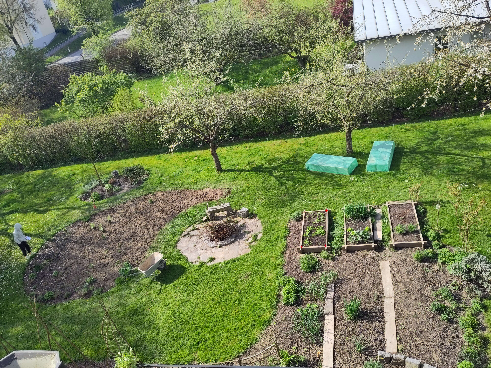
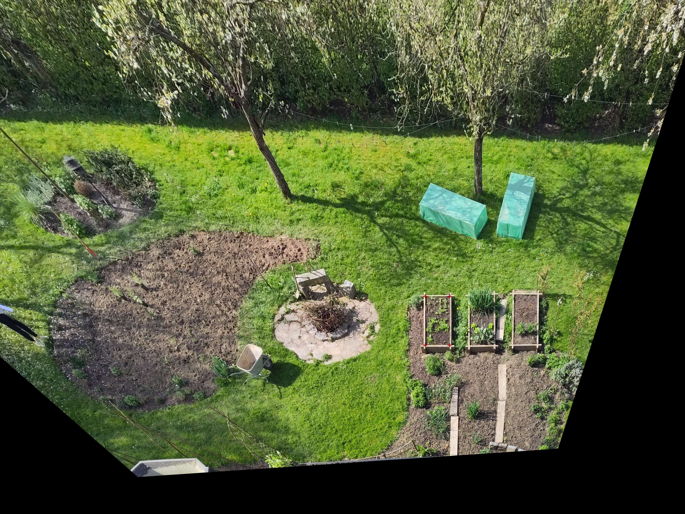

# Inverse Perspective Mapping

Use Inverse Perspective Mapping to create a bird eye view from an image.
Use a reference in the image to be able to make measurement.

Based on [this](https://stackoverflow.com/a/57440865/92049) answer on Stackoverflow.

Input image:



Output image:



# Usage

``` shell
python run.py
feh result.jpg
```
